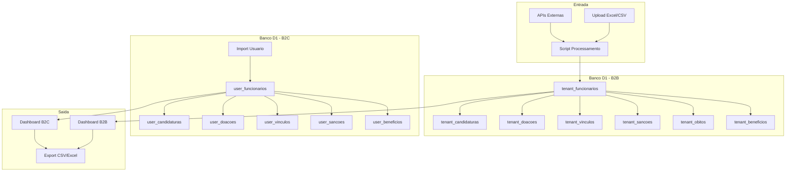

# Diagrama ER - investigaree

**Atualizado em:** 30/11/2025

## Diagrama de Entidade-Relacionamento

```mermaid
erDiagram
    %% ==========================================
    %% CORE: Usuarios e Tenants
    %% ==========================================

    users {
        TEXT id PK "UUID"
        TEXT firebase_uid UK "Firebase Auth UID"
        TEXT email UK "Email unico"
        TEXT name "Nome completo"
        TEXT phone "Telefone"
        TEXT created_at "Data criacao"
        TEXT updated_at "Data atualizacao"
    }

    tenants {
        TEXT id PK "UUID"
        TEXT code UK "CLIENTE_01, CLIENTE_02"
        TEXT name "Nome do cliente"
        TEXT email UK "Email de contato"
        TEXT firebase_uid UK "Firebase UID"
        TEXT status "active, inactive, suspended"
        TEXT config "JSON configuracoes"
        TEXT created_at "Data criacao"
        TEXT updated_at "Data atualizacao"
    }

    user_tenants {
        TEXT id PK "UUID"
        TEXT user_id FK "ID do usuario"
        TEXT tenant_id FK "ID do tenant"
        TEXT role "admin, editor, viewer"
        TEXT granted_by "Quem concedeu"
        TEXT granted_at "Data concessao"
        TEXT expires_at "Data expiracao"
        INTEGER is_active "0 ou 1"
        TEXT created_at "Data criacao"
        TEXT updated_at "Data atualizacao"
    }

    %% ==========================================
    %% LEADS: Captacao
    %% ==========================================

    leads {
        TEXT id PK "UUID"
        TEXT firebase_uid "Firebase UID"
        TEXT name "Nome"
        TEXT email "Email"
        TEXT phone "Telefone"
        TEXT origin "landing_page"
        INTEGER consent "0 ou 1"
        TEXT created_at "Data criacao"
    }

    whatsapp_leads {
        TEXT id PK "UUID"
        TEXT nome "Nome"
        TEXT contato "Email ou telefone"
        TEXT mensagem "Mensagem"
        TEXT origem "whatsapp"
        TEXT pagina "Pagina origem"
        INTEGER total_contatos "Contador"
        TEXT created_at "Data criacao"
        TEXT updated_at "Data atualizacao"
    }

    %% ==========================================
    %% DADOS DO TENANT: Funcionarios e Verificacoes (B2B)
    %% ==========================================

    tenant_funcionarios {
        TEXT id PK "UUID"
        TEXT tenant_id FK "ID do tenant"
        TEXT cadastro "Numero cadastro"
        TEXT nome "Nome completo"
        TEXT cpf "CPF"
        INTEGER cpf_valido "0 ou 1"
        TEXT data_nascimento "Data nasc"
        TEXT sexo "M ou F"
        TEXT cargo "Cargo"
        REAL salario "Salario"
        TEXT data_admissao "Data admissao"
        TEXT data_cessao "Data cessao"
        TEXT vinculo "Tipo vinculo"
        TEXT local_trabalho "Local"
        TEXT centro_custo "Centro custo"
        TEXT grupo "Disposicao, Comurg"
        TEXT esta_vivo "SIM, NAO"
        TEXT esta_morto "SIM, NAO"
        INTEGER ano_obito "Ano obito"
        INTEGER recebe_beneficio "0 ou 1"
        TEXT qual_beneficio "Tipo"
        INTEGER socio_empresa "0 ou 1"
        INTEGER qtd_empresas "Quantidade"
        INTEGER doador_campanha "0 ou 1"
        REAL valor_doacoes "Total"
        INTEGER candidato "0 ou 1"
        INTEGER sancionado_ceis "0 ou 1"
        INTEGER sancionado_ofac "0 ou 1"
    }

    tenant_candidaturas {
        TEXT id PK "UUID"
        TEXT tenant_id FK "ID do tenant"
        TEXT funcionario_id FK "ID funcionario"
        TEXT cpf "CPF candidato"
        TEXT nome "Nome candidato"
        TEXT cargo "Cargo disputado"
        TEXT partido "Sigla partido"
        TEXT numero_candidato "Numero urna"
        TEXT uf "Estado"
        TEXT municipio "Cidade"
        INTEGER ano "Ano eleicao"
        TEXT situacao "Eleito, Suplente"
        INTEGER votos "Total votos"
    }

    tenant_doacoes {
        TEXT id PK "UUID"
        TEXT tenant_id FK "ID do tenant"
        TEXT funcionario_id FK "ID funcionario"
        TEXT cpf_doador "CPF doador"
        TEXT nome_doador "Nome doador"
        TEXT cpf_candidato "CPF candidato"
        TEXT nome_candidato "Nome candidato"
        TEXT partido "Sigla partido"
        TEXT cargo "Cargo disputado"
        INTEGER ano "Ano eleicao"
        REAL valor "Valor doacao"
        TEXT data_doacao "Data doacao"
    }

    tenant_vinculos {
        TEXT id PK "UUID"
        TEXT tenant_id FK "ID do tenant"
        TEXT funcionario_id FK "ID funcionario"
        TEXT cpf_socio "CPF do socio"
        TEXT nome_socio "Nome socio"
        TEXT cnpj "CNPJ empresa"
        TEXT razao_social "Razao social"
        TEXT nome_fantasia "Nome fantasia"
        TEXT qualificacao "Socio-Admin"
        TEXT situacao_cadastral "ATIVA, BAIXADA"
        REAL capital_social "Capital social"
        TEXT data_entrada "Data entrada"
    }

    tenant_sancoes {
        TEXT id PK "UUID"
        TEXT tenant_id FK "ID do tenant"
        TEXT funcionario_id FK "ID funcionario"
        TEXT cpf "CPF sancionado"
        TEXT nome "Nome sancionado"
        TEXT tipo_sancao "CEIS, CNEP, OFAC"
        TEXT orgao_sancionador "Orgao"
        TEXT fundamentacao "Motivo"
        TEXT data_inicio "Inicio sancao"
        TEXT data_fim "Fim sancao"
    }

    tenant_obitos {
        TEXT id PK "UUID"
        TEXT tenant_id FK "ID do tenant"
        TEXT funcionario_id FK "ID funcionario"
        TEXT cpf "CPF falecido"
        TEXT nome "Nome falecido"
        TEXT data_obito "Data obito"
        INTEGER ano_obito "Ano obito"
        TEXT fonte "INFOSIMPLES, RFB"
    }

    tenant_beneficios {
        TEXT id PK "UUID"
        TEXT tenant_id FK "ID do tenant"
        TEXT funcionario_id FK "ID funcionario"
        TEXT cpf "CPF beneficiario"
        TEXT nome "Nome beneficiario"
        TEXT tipo_beneficio "BPC, BOLSA_FAMILIA"
        REAL valor "Valor beneficio"
        TEXT mes_referencia "Mes ref"
        INTEGER ano_referencia "Ano ref"
    }

    %% ==========================================
    %% DADOS DO USUARIO: Funcionarios Individuais (B2C)
    %% ==========================================

    user_funcionarios {
        TEXT id PK "UUID"
        TEXT user_id FK "ID do usuario"
        TEXT cadastro "Numero cadastro"
        TEXT nome "Nome completo"
        TEXT cpf "CPF"
        TEXT grupo "Grupo"
        TEXT cargo "Cargo"
        REAL salario "Salario"
        TEXT data_admissao "Data admissao"
        TEXT esta_vivo "SIM, NAO"
        TEXT esta_morto "SIM, NAO"
        INTEGER ano_obito "Ano obito"
        INTEGER recebe_beneficio "0 ou 1"
        TEXT qual_beneficio "Tipo"
        INTEGER socio_empresa "0 ou 1"
        INTEGER qtd_empresas "Quantidade"
        INTEGER doador_campanha "0 ou 1"
        REAL valor_doacoes "Total"
        INTEGER candidato "0 ou 1"
        INTEGER sancionado_ceis "0 ou 1"
        INTEGER sancionado_ofac "0 ou 1"
    }

    user_obitos {
        TEXT id PK "UUID"
        TEXT user_id FK "ID do usuario"
        TEXT funcionario_id FK "ID funcionario"
        TEXT data_obito "Data obito"
        TEXT fonte "Fonte dados"
    }

    user_candidaturas {
        TEXT id PK "UUID"
        TEXT user_id FK "ID do usuario"
        TEXT funcionario_id FK "ID funcionario"
        TEXT cargo "Cargo disputado"
        TEXT partido "Sigla partido"
        TEXT uf "Estado"
        TEXT municipio "Cidade"
        INTEGER ano "Ano eleicao"
        TEXT situacao "Eleito, Suplente"
        INTEGER votos "Total votos"
    }

    user_doacoes {
        TEXT id PK "UUID"
        TEXT user_id FK "ID do usuario"
        TEXT funcionario_id FK "ID funcionario"
        TEXT nome_candidato "Nome candidato"
        TEXT cpf_candidato "CPF candidato"
        TEXT partido "Sigla partido"
        TEXT cargo "Cargo"
        INTEGER ano "Ano eleicao"
        REAL valor "Valor doacao"
    }

    user_vinculos {
        TEXT id PK "UUID"
        TEXT user_id FK "ID do usuario"
        TEXT funcionario_id FK "ID funcionario"
        TEXT cnpj "CNPJ empresa"
        TEXT razao_social "Razao social"
        TEXT nome_fantasia "Nome fantasia"
        TEXT qualificacao "Qualificacao"
        TEXT data_entrada "Data entrada"
        TEXT situacao_cadastral "Situacao"
        REAL capital_social "Capital social"
    }

    user_sancoes {
        TEXT id PK "UUID"
        TEXT user_id FK "ID do usuario"
        TEXT funcionario_id FK "ID funcionario"
        TEXT tipo_sancao "Tipo sancao"
        TEXT orgao_sancionador "Orgao"
        TEXT fundamentacao "Motivo"
        TEXT data_inicio "Inicio"
        TEXT data_fim "Fim"
    }

    user_beneficios {
        TEXT id PK "UUID"
        TEXT user_id FK "ID do usuario"
        TEXT funcionario_id FK "ID funcionario"
        TEXT tipo_beneficio "Tipo"
        REAL valor "Valor"
        INTEGER ano_referencia "Ano"
    }

    user_settings {
        TEXT id PK "UUID"
        TEXT user_id FK UK "ID do usuario"
        TEXT empresa_nome "Nome empresa"
        TEXT empresa_cnpj "CNPJ empresa"
        TEXT plano "free, pro, enterprise"
        INTEGER limite_funcionarios "Limite"
    }

    %% ==========================================
    %% ADMINISTRATIVO
    %% ==========================================

    admin_alerts {
        TEXT id PK "UUID"
        TEXT type "new_user, error"
        TEXT title "Titulo alerta"
        TEXT message "Mensagem"
        TEXT data "JSON dados"
        TEXT severity "info, warning, error"
        INTEGER is_read "0 ou 1"
        TEXT read_by "Email leitor"
        TEXT read_at "Data leitura"
        TEXT created_at "Data criacao"
    }

    admin_notification_settings {
        TEXT id PK "UUID"
        TEXT admin_email UK "Email admin"
        INTEGER notify_new_users "0 ou 1"
        INTEGER notify_new_leads "0 ou 1"
        INTEGER notify_errors "0 ou 1"
        TEXT created_at "Data criacao"
        TEXT updated_at "Data atualizacao"
    }

    admin_users {
        TEXT id PK "UUID"
        TEXT user_id FK "ID usuario"
        TEXT email UK "Email admin"
        TEXT role "super_admin, admin"
        TEXT created_at "Data criacao"
        TEXT updated_at "Data atualizacao"
    }

    %% ==========================================
    %% RELACIONAMENTOS: Core
    %% ==========================================

    users ||--o{ user_tenants : "tem acessos"
    tenants ||--o{ user_tenants : "permite usuarios"
    users ||--o| admin_users : "pode ser admin"

    %% ==========================================
    %% RELACIONAMENTOS: Tenant Data (B2B)
    %% ==========================================

    tenants ||--o{ tenant_funcionarios : "possui"
    tenant_funcionarios ||--o{ tenant_candidaturas : "candidatou"
    tenant_funcionarios ||--o{ tenant_doacoes : "doou"
    tenant_funcionarios ||--o{ tenant_vinculos : "e socio"
    tenant_funcionarios ||--o{ tenant_sancoes : "foi sancionado"
    tenant_funcionarios ||--o{ tenant_obitos : "faleceu"
    tenant_funcionarios ||--o{ tenant_beneficios : "recebe"

    %% ==========================================
    %% RELACIONAMENTOS: User Data (B2C)
    %% ==========================================

    users ||--o{ user_funcionarios : "possui"
    users ||--o| user_settings : "tem config"
    user_funcionarios ||--o{ user_obitos : "faleceu"
    user_funcionarios ||--o{ user_candidaturas : "candidatou"
    user_funcionarios ||--o{ user_doacoes : "doou"
    user_funcionarios ||--o{ user_vinculos : "e socio"
    user_funcionarios ||--o{ user_sancoes : "sancionado"
    user_funcionarios ||--o{ user_beneficios : "recebe"
```

---

## Legenda

| Simbolo | Significado |
|---------|-------------|
| `PK` | Primary Key |
| `FK` | Foreign Key |
| `UK` | Unique Key |
| `\|\|--o{` | Um para Muitos |
| `\|\|--o\|` | Um para Um (opcional) |

---

## Grupos de Tabelas

### 1. Core (Autenticacao e Acesso)
- **users**: Usuarios sincronizados com Firebase Auth
- **tenants**: Clientes/organizacoes (multi-tenant)
- **user_tenants**: Controle de acesso usuario-tenant

### 2. Leads (Captacao)
- **leads**: Leads capturados via landing page
- **whatsapp_leads**: Leads capturados via WhatsApp

### 3. Dados do Tenant (B2B Multi-Tenant)
- **tenant_funcionarios**: Base principal de funcionarios
- **tenant_candidaturas**: Candidaturas eleitorais (TSE)
- **tenant_doacoes**: Doacoes de campanha
- **tenant_vinculos**: Vinculos empresariais (QSA)
- **tenant_sancoes**: Sancoes (CEIS/CNEP/OFAC)
- **tenant_obitos**: Obitos verificados
- **tenant_beneficios**: Beneficios sociais (BPC, Bolsa Familia)

### 4. Dados do Usuario (B2C Individual)
- **user_funcionarios**: Funcionarios do usuario
- **user_obitos**: Obitos verificados do usuario
- **user_candidaturas**: Candidaturas do usuario
- **user_doacoes**: Doacoes do usuario
- **user_vinculos**: Vinculos do usuario
- **user_sancoes**: Sancoes do usuario
- **user_beneficios**: Beneficios do usuario
- **user_settings**: Configuracoes do usuario (plano, limites)

### 5. Administrativo
- **admin_alerts**: Sistema de alertas
- **admin_notification_settings**: Preferencias de notificacao
- **admin_users**: Usuarios com privilegios globais

---

## Migrations

| Migration | Arquivo | Tabelas |
|-----------|---------|---------|
| 003 | `003_whatsapp_leads.sql` | whatsapp_leads |
| 004 | `004_tenant_data.sql` | tenants, tenant_funcionarios, tenant_candidaturas, tenant_doacoes, tenant_vinculos, tenant_sancoes, tenant_obitos, tenant_beneficios |
| 005 | `005_user_tenants.sql` | user_tenants |
| 006 | `006_seed_admin_access.sql` | (seed data) |
| 007 | `007_admin_alerts.sql` | admin_alerts, admin_notification_settings |
| 008 | `008_create_admin_users.sql` | admin_users |
| 009 | `009_user_data_individual.sql` | user_funcionarios, user_obitos, user_candidaturas, user_doacoes, user_vinculos, user_sancoes, user_beneficios, user_settings |

---

## Fluxo de Dados



---

## Indices Criados

### Tenant Data (B2B)

| Tabela | Indice | Colunas |
|--------|--------|---------|
| tenants | idx_tenants_email | email |
| tenants | idx_tenants_code | code |
| tenant_funcionarios | idx_tenant_func_tenant | tenant_id |
| tenant_funcionarios | idx_tenant_func_cpf | cpf |
| tenant_funcionarios | idx_tenant_func_nome | nome |
| tenant_funcionarios | idx_tenant_func_grupo | tenant_id, grupo |
| tenant_candidaturas | idx_tenant_cand_tenant | tenant_id |
| tenant_candidaturas | idx_tenant_cand_cpf | cpf |
| tenant_doacoes | idx_tenant_doac_tenant | tenant_id |
| tenant_doacoes | idx_tenant_doac_cpf | cpf_doador |
| tenant_vinculos | idx_tenant_vinc_tenant | tenant_id |
| tenant_vinculos | idx_tenant_vinc_cpf | cpf_socio |
| tenant_sancoes | idx_tenant_sanc_tenant | tenant_id |
| tenant_sancoes | idx_tenant_sanc_cpf | cpf |
| tenant_obitos | idx_tenant_obito_tenant | tenant_id |
| tenant_obitos | idx_tenant_obito_cpf | cpf |
| tenant_beneficios | idx_tenant_benef_tenant | tenant_id |
| tenant_beneficios | idx_tenant_benef_cpf | cpf |

### User Data (B2C)

| Tabela | Indice | Colunas |
|--------|--------|---------|
| user_funcionarios | idx_user_funcionarios_user_id | user_id |
| user_funcionarios | idx_user_funcionarios_cpf | cpf |
| user_funcionarios | idx_user_funcionarios_nome | nome |
| user_obitos | idx_user_obitos_user_id | user_id |
| user_candidaturas | idx_user_candidaturas_user_id | user_id |
| user_doacoes | idx_user_doacoes_user_id | user_id |
| user_vinculos | idx_user_vinculos_user_id | user_id |
| user_sancoes | idx_user_sancoes_user_id | user_id |
| user_beneficios | idx_user_beneficios_user_id | user_id |
| user_settings | idx_user_settings_user_id | user_id |

### Access Control

| Tabela | Indice | Colunas |
|--------|--------|---------|
| user_tenants | idx_user_tenants_user | user_id |
| user_tenants | idx_user_tenants_tenant | tenant_id |
| user_tenants | idx_user_tenants_active | user_id, is_active |

### Admin

| Tabela | Indice | Colunas |
|--------|--------|---------|
| admin_alerts | idx_admin_alerts_type | type |
| admin_alerts | idx_admin_alerts_read | is_read |
| admin_alerts | idx_admin_alerts_created | created_at DESC |

### Leads

| Tabela | Indice | Colunas |
|--------|--------|---------|
| whatsapp_leads | idx_whatsapp_leads_contato | contato |
| whatsapp_leads | idx_whatsapp_leads_created_at | created_at |

---

**Documento gerado automaticamente**
